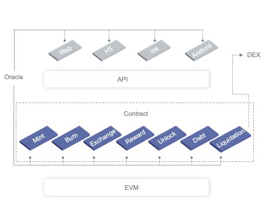
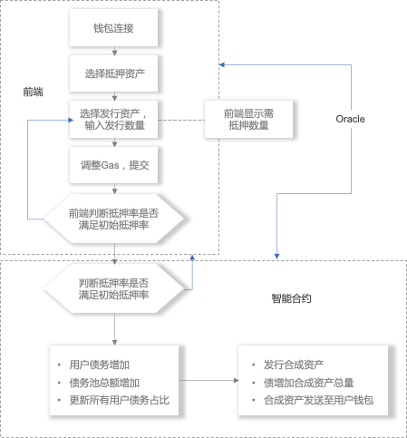
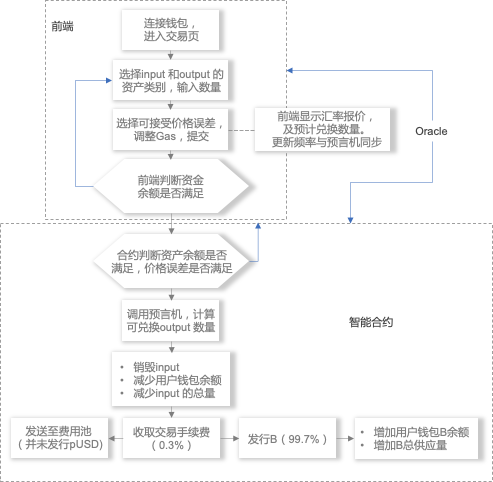
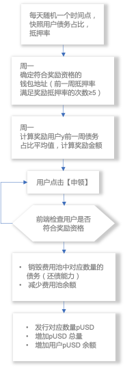
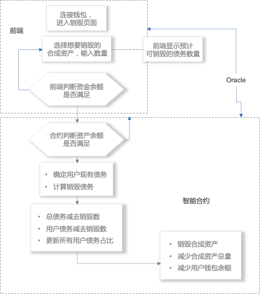

# Prism迁移及验证过程

## 关于Prism
Prism是运行在PlatON上的去中心化合成资产发行协议，任何人都可以使用这套协议重新合成传统金融产品和新型金融衍生品，并参与交易。Prism向交易者提供广泛类别的数字资产及传统资产的衍生品交易，致力于为用户打造更安全、更便捷、更高效的合成资产交易平台。 用户可通过多种质押方式在Prism发行合成资产，也可通过购买合成资产直接与其他类别的合成资产进行兑换。在此过程中，用户将获得双重奖励： ①因交易获得收益 ②为平台提供流动性获得收益。此外Prism采用独特的债务池模型和交易模型，有效地解决了DEX（去中心化交易所）经常所面临的流动性不足和交易滑点问题，同时引入DAO管理机制，使Prism面对需求具有更快的响应速度。

### 系统架构



### 铸造

1. 用户选择想要抵押的资产，以及想要发行的合成资产数量，委托给智能合约。
2. 合约判断其抵押率是否满足，锁定其抵押资产。
3. 合约更新用户及债务池的债务，发行相应的合成资产。
4. 已抵押的资产，合约会根据抵押率，进行锁定和解锁。
5. 用户可通过追加资产或销毁债务的方式，对抵押率进行调整。



### 交易

1. 用户选择想要出售及兑换的合成资产，指定兑换数量，提交交易申请至合约。
2. 合约根据预言机报价，确定可兑换的资产数量。合约销毁input 资产，发行output 资产（99.7%）。
3. 合约扣除0.3%的价值（债务）作为手续费，发送至费用池。



### 奖励

1. 合约每天随机取一个时间点，对用户债务占比，抵押率进行快照。
2. 周一 确定符合奖励资格的钱包地址（前一周抵押率满足奖励抵押率的次数 ≥ 5）。
3. 周一 计算奖励用户前一周债务占比平均值，计算奖励金额。
4. 用户提交申领申请至合约。合约判断用户是否具备申领资格。
5. 合约将费用池中的奖励以及PRM奖励按照比例分发给符合奖励资格的用户。



### 销毁

1. 用户指定想要销毁的合成资产数量，提交销毁请求至合约。
2. 合约判断用户资产余额是否满足。调用预言机获取汇率，确定用户当前债务。
3. 合约更新债务池总数、用户债务数（减去对应债务）。
4. 合约减少对应合成资产的总量和用户钱包余额。



### 债务池

LP通过抵押资产，在Prism发行合成资产时，应视为对Prism的负债，所有LP债务的总和，即构成债务池。
> 总债务 = ∑ Synth(i) * 当前汇率(i)        (单位：usd)
> 
> 个人债务 = 总债务 * 个人债务占比

债务池的债务总额会跟随合成资产价格的涨跌而发生变化。个人债务占比会在铸造或销毁合成资产时更新，因此，LP的个人债务并不是固定不变的。

- 发行资产时的债务更新

	> 更新后个人债务 = 现有个人债务 + 新增个人债务

	> 新增个人债务 = 发行资产数量 * 资产汇率（对USD）

	> 更新后总债务 = 现有总债务 + 新增个人债务

- 销毁资产时的债务更新

	> 更新后个人债务 =现有个人债务 – 销毁个人债务
	
	> 销毁个人债务 = 销毁资产数量 * 资产汇率（对USD）
	
	> 更新后总债务 = 现有总债务 – 销毁个人债务


## 参考资料

- [以太坊DApp快速迁移教程](https://alaya.network/alaya-devdocs/zh-CN/DApp_migrate/)
- [迁移教程](https://devdocs.platon.network/docs/zh-CN/Solidity_Contract_Migrate/)

## 迁移思路
PlatON和Alaya网络升级后已高度兼容以太坊，大大减少了DAPP迁移的工作量。对Prism项目来说，只有涉及到时间戳的部分代码需要迁移。

- 合约代码
	-  AssetPrice.sol 该合约负责从预言机中获取各资产的价格，其中maxDelayTime记录着报价的最大延迟时间，该参数数值为外部设置，合约无需修改。

		```plain
		    function setMaxDelayTime(uint256 time) external onlyOwner {
		        emit MaxDelayTimeChanged(maxDelayTime, time);
		        maxDelayTime = time;
		    }
		```

	-  Setting.sol 该合约负责保存系统的公用参数，这些参数数值为外部设置，合约无需修改。

		```plain
		    function setMintPeriodDuration(uint256 time) external onlyOwner {
		        emit SettingChanged(MINT_PERIOD_DURATION, bytes32(0), Storage().getUint(MINT_PERIOD_DURATION), time);
		        Storage().setUint(MINT_PERIOD_DURATION, time);
		    }
		```

	-  SupplySchedule.sol 该合约负责计算代币发行量，在PlatON网络中，365 days 的计算结果单位是秒需要转换为毫米
		
		```plain
		    function _getYearlyPeriods() private view returns (uint256) {
		        uint256 year = 365 days * 1000;
		        return year.div(Setting().getMintPeriodDuration());
		    }
		```

- 部署代码
	-  4_deploy_asset_price.js 部署该合约时，需要将数值设置为毫秒

		```plain
		    await deployer.deploy(AssetPrice);
		    let assetPrice = await AssetPrice.deployed();
		    await assetPrice.setMaxDelayTime(3600 * 3 * 1000);
		```

	-  5_deploy_setting.js 部署该合约时，需要将数值设置为毫秒

		```plain
			await deployer.deploy(Setting);
			let setting = await Setting.deployed();
			await setting.setMintPeriodDuration(3600 * 24 * 7 * 1000);
		```

	-  6_deploy_supply_schedule.js 部署该合约时，需要将开始时间设置为毫秒

		```plain
			let startTime = 1635696000 * 1000;
			await deployer.deploy(SupplySchedule, resolver.address, startTime, 0);
		```

## 编译合约

可以直接使用原始版本的 truffle进行编译

```plain
truffle compile
```

## 部署合约

```plain
truffle migrate
```

```plain
   Deploying 'AssetPrice'
   ----------------------
   > transaction hash:    0x2392d5e93c44386169c78eed7bcedb508853cc0e59901872e7771f3a12630fe0
   > Blocks: 3            Seconds: 4
   > contract address:    0xfb680D29f84C64337bE810AA495fEb30E75C93F0
   > block number:        19071476
   > block timestamp:     1636346030492
   > account:             0x8e8289E2c74F1Bc35fD96F0F8A9DB9381ec32863
   > balance:             209.98225854
   > gas used:            2001301 (0x1e8995)
   > gas price:           1 gwei
   > value sent:          0 ETH
   > total cost:          0.002001301 ETH

      Deploying 'Setting'
   -------------------
   > transaction hash:    0x1314500a8aaac5b55df03c6a25d5630c2d2ef985d9541779e4ba01f103a3c6af
   > Blocks: 4            Seconds: 4
   > contract address:    0x243d6DefDDAc986b6a72a5DaE02A3Cf9E0Ee430A
   > block number:        19071735
   > block timestamp:     1636346317947
   > account:             0x8e8289E2c74F1Bc35fD96F0F8A9DB9381ec32863
   > balance:             209.980308617
   > gas used:            1846642 (0x1c2d72)
   > gas price:           1 gwei
   > value sent:          0 ETH
   > total cost:          0.001846642 ETH

   Deploying 'SupplySchedule'
   --------------------------
   > transaction hash:    0x761be97a2fd25cb7a2822e9d9a335860e61124c1060db27f86eca92b0103711e
   > Blocks: 5            Seconds: 4
   > contract address:    0x0E4D0E79a40965419658A23a88115d6162FAa059
   > block number:        19072855
   > block timestamp:     1636347817062
   > account:             0x8e8289E2c74F1Bc35fD96F0F8A9DB9381ec32863
   > balance:             209.975983876
   > gas used:            2649712 (0x286e70)
   > gas price:           1 gwei
   > value sent:          0 ETH
   > total cost:          0.002649712 ETH

```

## 验证

欢迎大家到[https://prisma.one/](http://prisma.one/)测试项目。
