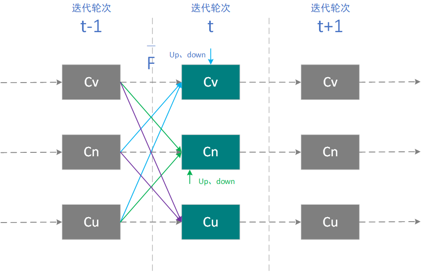

## 系统设计

可信度包括News可信度、Viewpoint可信度、user可信度，满足以下可信度约束关系：

1. Viewpoint可信度由的author user可信度、news可信度，对该vp的点赞、踩操作决定：
    1. 该vp支持的news，两者可信度正相关；反对的news，两者可信度负相关；
    2. 与点赞user的可信度正相关；与踩user的可信度负相关；
    3. 与author user的可信度正相关；
2. News可信度由的author user可信度、viewpoing可信度，对该news的点赞、踩操作决定：
    1. 与author user可信度正相关；
    2. 与支持vp的可信度正相关；反之亦然；
    3. 与点赞user的可信度正相关；反之亦然。
3. user可信度由相关news、viewpoint可信度决定，相关包括：作为author、作为点赞/踩的参与者：
    1. author user可信度与news可信度正相关，viewpoint同理；
    2. 点赞uesr可信度与news可信度正相关，viewpoint同理；踩uesr可信度反之亦然。
## 关键技术

1. 根据上述可信度约束关系，可信度评估模型的设计思路如下：
- 理论上，由于user、news、viewpoint相互间都存在影响，即存在以下方程组：

$$C_{Viewpoint}=C_{V}=f_{V}(C_{U}, C_{N}, up, down)$$
$$C_{News}=C_{N}=f_{N}(C_{U}, C_{V}, up, down)$$
$$C_{User}=C_{U}=f_{U}(C_{N}, C_{V})$$

- 简化成向量形式为，令向量

$$ \bar{C} = (C_{U},C_{V},C_{N}) $$

，有向量方程：
$$\bar{C}=\bar{F}(\bar{C},up,down)$$
，其中up、down是每次计算时的常量；

- 这实际上是一个不动点方程，可采用迭代求解，其原理如下：

即迭代执行$$\bar{C}_{t}\leftarrow\bar{F}(\bar{C}_{t-1})$$，直至收敛；

- 向量方程有解，即不动点存在，这需要满足Lipschitz条件（$$\bar{F}$$是一个收缩算子），即$$\bar{F}$$需要满足：$$||\bar{C}_{t} - \bar{C}_{t-1}||=||\bar{F}(\bar{C}_{t-1})-\bar{F}(\bar{C}_{t-2})||\leq\gamma ||\bar{C}_{t-1} - \bar{C}_{t-2}||$$，其中$$\gamma \in[0,1)$$；
- 其求解过程依赖于收敛性，收敛速度依赖于γ值得大小，然而这种迭代收敛求解的方式并不适合链上的算力情况，会导致每次计算的gas消耗过高，甚至无法在最高gas限制下完成计算；
- 如果有可验证计算基础设置的支撑，可以将合约中的计算过程从链上扩展到链下完成，则可以设计出更加精确的模型，幸运的是PlatON隐私计算基础设施将在未来支持可验证计算，但在其落地之前，尚无比较合适的工程手段，由此可见，PlatON隐私计算的基础设施，对未来诸多更加复杂应用的落地，确实是非常有价值的；
2. 可信度评估模型的准确度，取决于数据的不断扩展，从理论上讲，项目发展到后期必然会通过一个无监督学习模型来作为评估模型，但具体实施至少还需要考虑以下两个方面：
    1. 数据积累没有达到一定量级以前，需要通过设计符合上面可信度约束关系的显示数学模型来过渡；
    2. 在可验证计算落地前，基于无监督AI模型的可信度评估模型难以落地，因为链上由于不支持浮点运算、算力有限等问题，对计算模型的复杂度限制很大，模型的训练、计算过程从链上扩展到链下难以开展；
3. 用户可信度的取值范围是(0, +∞)，即用户的任何操作，都会带来被操作对象可信度的改变，news、viewpoint可信度没有限制，小数点后面两位；
4. 在News、Viewpoint的评估模型中，采用指数平均；
5. 该模型具有在线自进化的特点，即使用者越多、用的时间越久，则可信度评估越准确；
## 详细设计

综上所述，考虑隐私计算基础设施的当前状态，以及链上智能合约执行的算力局限，在黑客松阶段，需要在兼顾评估准确性、链上执行效率、gas消耗的基础上，对模型的复杂度进行控制，该模型需要能够符合前文中提到的可信度约束条件，具有较高的链上可执行性，需要牺牲一定的收敛时间消耗，但依然满足平台参与者越多、运行时间越久，可信度评估的准确度越高的特点，详细设计见下文。

说明：

1. 为便于理解，下述公式写成加权平均的形式，实际实施采用指数平均；
2. 以下公式以及参数的默认设置，根据仿真结果，在后续的开发中可能会进行细微的调整。
### Viewpoint可信度

#### 计算公式

$$C_{V}=\alpha _{V}\cdot C_{N}\cdot(isSupport)+\beta _{V}\cdot(\frac{\sum_{}{C_{u_{i}}\cdot(isUp)}}{n_{up+down}})+\gamma _{V}\cdot (C_{u_{author}})$$

令：

1. $$C_{V}^{N}=\alpha _{V}\cdot C_{N}\cdot(isSupport)$$
2. $$C_{V}^{up+down}=\beta _{V}\cdot(\frac{\sum_{}{C_{u_{i}}\cdot(isUp)}}{n_{up+down}})$$
3. $$C_{V}^{author}=\gamma _{V}\cdot (C_{u_{author}})$$
说明：

1. Viewpoint可信度由关联的news以及自身观点、点赞（up）的用户、踩的（down）用户，以及作者的可信度决定；
2. 可以证明，该计算方式，满足上文中提到的可信度约束关系。
#### 参数说明

1. $$\alpha _{V}$$
代表其相关news的可信度权重，默认设置为0.3；

2. $$\beta _{V}$$
代表点赞、踩用户带来的可信度权重，默认设置为0.4；

3. $$\gamma _{V}$$
代表作者带来的可信度权重，默认0.3；

4. 在更合理的模型中$$\alpha _{V}$$、$$\beta _{V}$$、$$\gamma _{V}$$权重应该是根据操作量可变的，在本次黑客松中是否实施视开发进度而定；
5. 支持，isSupport为1；反对，isSupport为-1;
6. 点赞，isUp为1；踩，isUp为-1。
### News可信度

#### 计算公式

$$C_{N}=\alpha _{N}\cdot \sum_{i}^{viewpoint}(\frac{C_{V}}{n_{views}}\cdot(isSupport))+\beta _{N}\cdot(\frac{\sum_{}{C_{u_{i}}\cdot(isUp)}}{n_{up+down}})+\gamma _{N}\cdot (C_{u_{author}})$$

令：

1. $$C_{N}^{view}=\alpha _{N}\cdot \sum_{i}^{viewpoint}(\frac{C_{V}}{n_{views}}\cdot(isSupport))$$
2. $$C_{N}^{up+down}=\beta _{N}\cdot(\frac{\sum_{}{C_{u_{i}}\cdot(isUp)}}{n_{up+down}})$$
3. $$C_{N}^{author}=\gamma _{N}\cdot (C_{u_{author}})$$
说明：

1. news可信度由关联的Viewpoint及其观点、点赞（up）的用户、踩的（down）用户，以及作者的可信度决定；
2. 可以证明，该计算方式，满足上文中提到的可信度约束关系。
#### 参数说明

1. $$\alpha _{N}$$
代表其相关viewpoint的可信度权重，默认设置为0.4；

2. $$\beta _{N}$$
代表点赞、踩用户带来的可信度权重，默认设置为0.3；

3. $$\gamma _{N}$$
代表作者带来的可信度权重，默认0.3；

4. 更合理的模型中$$\alpha _{N}$$、$$\beta _{N}$$、$$\gamma _{N}$$权重是根据操作量可变的，在本次黑客松中是否实现视开发进度而定；
5. 支持，isSupport为1；反对，isSupport为-1；
6. 点赞，isUp为1；踩，isUp为-1。
### User可信度

#### 计算公式

$$C_{U}=\alpha _{U}\cdot\sum_{News}^{Author}{\frac{C_{N}}{n_{NAuthor}}}+\beta _{U}\cdot\sum_{viewpoint}^{Author}{\frac{C_{V}}{n_{VAuthor}}}+\gamma _{U}\cdot(\sum_{}^{News}{\frac{C_N\cdot(isUp)}{n_{up+down}}})+\eta _{U}\cdot(\sum_{}^{viewpoint}{\frac{C_V\cdot(isUp)}{n_{up+down}}})$$

令：

1. $$C_{U}^{Nauthor}=\alpha _{U}\cdot\sum_{News}^{Author}{\frac{C_{N}}{n_{NAuthor}}}$$
2. $$C_{U}^{Vauthor}=\beta _{U}\cdot\sum_{viewpoint}^{Author}{\frac{C_{V}}{n_{VAuthor}}}$$
3. $$C_{U}^{Nup+down}=\gamma _{U}\cdot(\sum_{}^{News}{\frac{C_N\cdot(isUp)}{n_{up+down}}})$$
4. $$C_{U}^{Vup+down}=\eta _{U}\cdot(\sum_{}^{viewpoint}{\frac{C_V\cdot(isUp)}{n_{up+down}}})$$
说明：

1. user可信度由相关联的news、观点，包括作为author发布的，作为点赞/踩者操作的；
2. 可以证明，该计算方式，满足上文中提到的可信度约束关系。
#### 参数说明

1. $$\alpha _{U}$$
代表作为作者发布的News的可信度权重，默认设置为0.4；

2. $$\beta _{U}$$
代表作为作者发布的Viewpoint的可信度权重，默认设置为0.3；

3. $$\gamma _{U}$$
代表作为点赞/踩者的news可信度权重，默认0.2；

4. $$\eta _{U}$$
代表作为点赞/踩者的viewpoint可信度权重，默认0.1；

5. 更合理的模型中$$\alpha _{N}$$、$$\beta _{N}$$、$$\gamma _{N}$$、$$\eta _{U}$$权重是根据操作量可变的，在本次黑客松中是否实现视开发进度而定；
6. 点赞，isUp为1；踩，isUp为-1。
