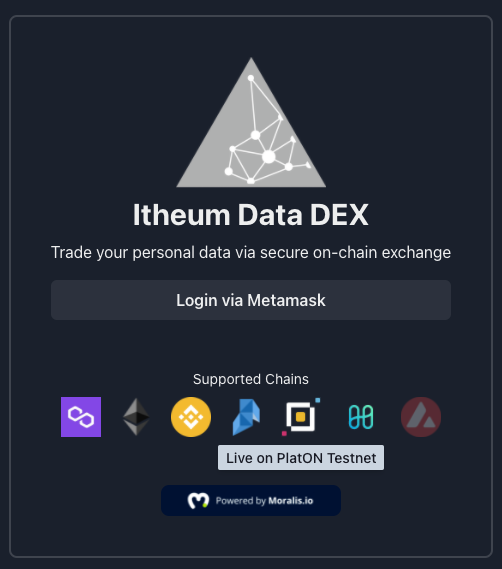
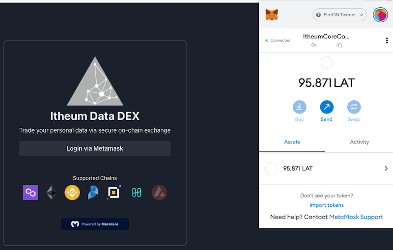
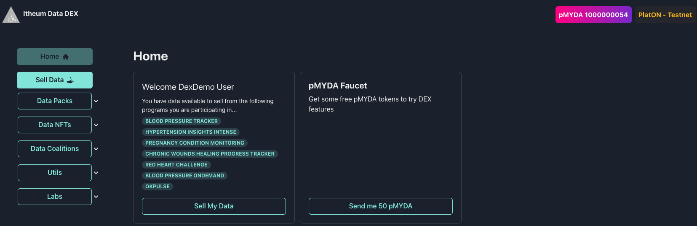
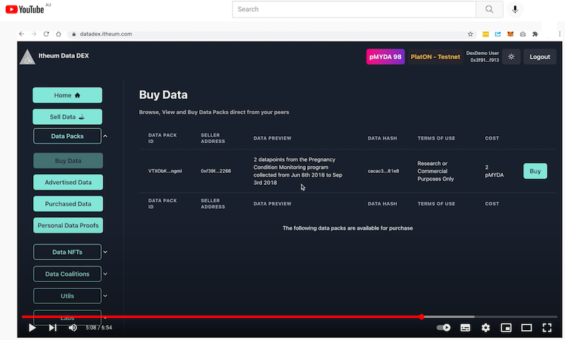

# HackathonPLUS - Itheum > Trusted Computation Framework for Data Sharing

## Milestone 1 Progress Updates
| Number | Deliverable | Specification |
| ------------- | ------------- | ------------- |
| 0a. | License | Open Source License |
| 0b. | Documentation | We will provide code description documents and basic tutorials, which will explain how to use our products. |
| 0c. | Testing Guide	 | In order to ensure the integrity of the function and the robustness of the system, we will provide a test coverage of the code and explain how to run these test cases.| 
| 1. | Module 1: 1 | Work on efficient design and deploy our core Data DEX contracts to PlatON EVM via our deployment pipeline |
| 2. | Module 1: 2 | Work with PlatON team and finalise correct integration pattern for next stage of trusted computation, the output will be a design guide on how we will proceed to next milestone |

---

 

## Module 1: 1: Work on efficient design and deploy our core Data DEX contracts to PlatON EVM via our deployment pipeline

 

- This been delivered and is fully functional and the `beta link` is here: https://datadex.itheum.com/
- Itheum <> PLatON Integration explanation video: https://www.youtube.com/watch?v=5t1e6tSqJ6U 
- PlatON Wallet based login live demo video: https://youtu.be/5t1e6tSqJ6U?t=220

 

### Operation / user guide

1) Visit https://datadex.itheum.com/

 

2) You will see that PlatON testnet chain support has been enabled:

 

  

 

3) Login with your Metamask wallet:

 

  

 

3) You are no logged in and can use all the features of the Itheum Data DEX on the PlatON chain:

 

  

 

4) For a detailed walk-though on all the features (Faucet, Sell Data, Buy Data, Data NFT etc), please view the walkthrough demo video here: https://youtu.be/5t1e6tSqJ6U?t=220

 

  

 
 

---

 

## Module 1: 2: Work with PlatON team and finalise correct integration pattern for next stage of trusted computation, the output will be a design guide on how we will proceed to next milestone

 

- This meeting happened with the Itheum and PlatON Core team on `8/12/2021`
- The next steps for our collboraation are detailed here: https://github.com/Itheum/data-dex/wiki/PlatON-Integration-Notes

 

---

 

## Open Source Repository and Test Cases
- All source code is completely Open Source and available under the following repositories:

### Itheum Data DEX
- Source code is here: https://github.com/Itheum/data-dex
- PlatON integration source code changes are highlighted in this ticket: https://github.com/Itheum/data-dex/issues/50

### Itheum Core (Smart Contracts)
- Source code is here: https://github.com/Itheum/itheumcore
- PlatON integration source code changes are highlighted in this ticket: https://github.com/Itheum/itheumcore/issues/4
- All automated test cases are available via the HardHat TDD framework. 
- Unit Tests are available here: https://github.com/Itheum/itheumcore/blob/main/test/itheumcore-test.js
- You can run the tests via the `npx hardhat watch tdd` command

 

---
