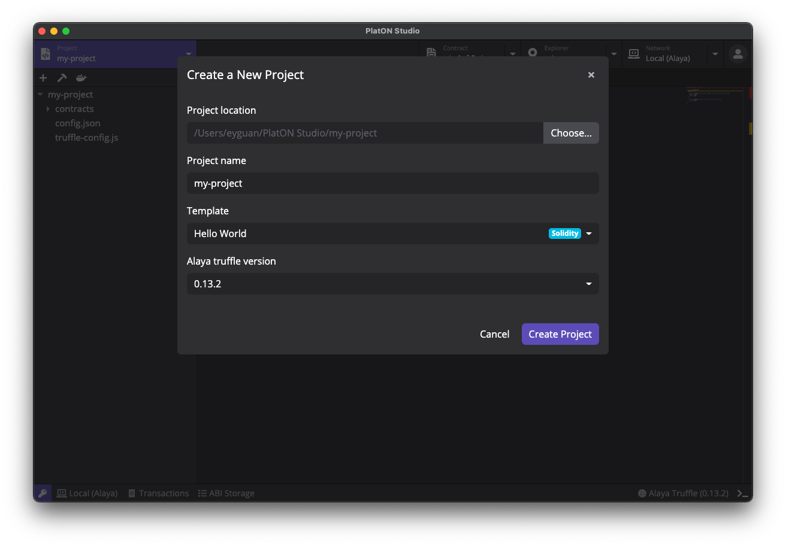

# PlatON Studio

PlatON Studio 是一个帮助开发者快速开发 [PlatON](https://platon.network/) 智能合约的集成化开发环境，同时支持 [Alaya 先行网络](https://alaya.network) 和 [PlatON 主网络](https://platon.network) 上的合约开发、部署和调试。PlatON Studio 现已提供运行于 macOS、Windows 和 Linux 的桌面版。

  

## 使用 PlatON Studio

### PlatON Studio 桌面版

PlatON Studio 安装包可以在 [Github Releases](https://github.com/ObsidianLabs/PlatON-Studio/releases) 进行下载。目前 PlatON Studio 桌面版支持 macOS、Linux 和 Windows 系统，请根据系统下载对应的版本 （macOS 下载 `.dmg` 或者 `.zip`，Linux 下载 `.AppImage`，Windows 下载 `.exe`）。

- **macOS**: 双击打开 `PlatONStudio-x.x.x.dmg` 并将 `PlatON Studio` 拖动到应用文件夹内；
  - 第一次运行 PlatON Studio 时，可能会收到系统 *”无法打开 PlatON Studio，因为 Apple 无法检查其是否包含恶意软件“* 的提示。此时请打开 *系统偏好设置* ，前往 *安全性与隐私*。点按 *通用* 面板中 *仍要打开* 按钮以允许 PlatON Studio 运行；
- **Linux**: 双击打开 `PlatONStudio-x.x.x.AppImage`；
  - 如果双击打开无效，右键点击 `PlatONStudio-x.x.x.AppImage`，选择 *Properties* => *Permissions* => *Execute*，将 *Allow executing file as program* 选项打勾。关闭属性设置窗口并双击打开应用（不同的 Linux 发行版可能会有不同的安装方式）；
- **Windows**:  双击打开 `PlatONStudio-x.x.x.exe`。

## 功能预览

以下示例以 PlatON Studio v0.7.0 macOS 桌面版为例，PlatON Studio 各版本操作界面和功能均保持一致，实际操作以界面显示为准。

### 准备工作

在正确安装 PlatON Studio 并初次启动时，你将看到一个欢迎页面，这里有 PlatON Studio 正常运行所需要的依赖，包括了 Docker，Alaya Node 以及 Alaya Truffle .

  

- PlatON Studio 使用 [**Docker**](https://www.docker.com/) 来启动 PlatON 节点和进行项目编译。如果你之前没有安装过 Docker，可以点击 *Install Docker* 按钮访问 Docker 官方网站并进行下载安装；
- **Alaya Node in Docker** 是 Alaya 节点镜像，PlatON Studio 使用这个镜像来运行 Alaya 节点；
- **Alaya Truffle in Docker** 是 Alaya 版本的 Truffle。PlatON Studio 使用这个工具包进行项目的创建和编译。

当所有依赖都正确安装并运行后，灰色的 *Skip* 按钮将会变成蓝紫色的 *Get Started* 按钮。点击这个按钮进入 PlatON Studio 的主界面。

### 密钥管理器

进入主界面后，我们需要首先创建一些密钥对。在 PlatON Studio 的任意界面，点击应用左下⻆的钥匙图标，打开密钥管理器。

  

你可以在密钥管理器中创建、导入并管理密钥对。PlatON Studio 支持对 PlatON、Alaya、和本地开发网络，分别储存不同地址格式的秘钥对（分别以`lat`、`atp`、`atx`作为地址开头）。密钥对名称是一个由用户自定义的名称，目的是方便在后续的使用中进行识别。PlatON Studio 支持以私钥或助记词的方式生成密钥。生成密钥时，默认以私钥方式生成。如需切换为助记词，请点击 *Regenerate* 按钮旁边的三角箭头切换。

  

如需导入密钥，点击密钥管理器左下角的 *Import* 按钮，输入密钥对名称，并在私钥/助记词输入框中输入希望导入的私钥或助记词，PlatON Studio 将根据输入格式自动检测。如果输入的是有效的私钥或助记词，输入框下方将显示对应的地址，确认无误后点击 *Import* 按钮即可完成导入。

  

在继续之前，请先在密钥管理器中创建一些密钥对，以便我们完成接下来的操作步骤。在本示例中，我们将使用 `miner`，`keypair-1`，`keypair-2` 三对密钥完成接下来的步骤。

**注意：私钥和助记词是证明密钥所有权的关键凭证，请妥善保管，不要与他人分享。泄漏私钥或助记词，可能导致数字资产永久丢失。**

密钥管理器除了对密钥对进行储存管理外，还将为创世区块提供创世地址。创建新的本地节点实例时，会使用密钥管理器里所有的地址作为创世地址。*在继续之前，请先在密钥管理器中创建一些密钥对，作为接下来创建节点实例的创世地址。*

### 网络管理

#### 本地开发节点

点击顶部的 *Network* 标签，主页面将切换为网络管理器。在网络管理器中，我们可以进行本地节点版本和节点实例的管理，包括下载、删除本地节点版本，根据不同版本创建、删除和运行节点实例。

点击主页面中右上角的 *New Instance* 按钮打开创建新实例的弹窗，填写实例名称和选择合适的版本，点击 *Create* 按钮完成节点实例的创建。

创建新的 PlatON 节点实例时，你需要在密钥管理器已保存的密钥地址中指定一个矿工（Miner）。Miner 将作为本地网络的矿工进行出块。此处我们选择 `miner` 密钥作为我们本地 PlatON 节点的矿工。当本地节点启动时，会将矿工地址作为创世地址，并赋予创世地址一定数量的代币。

  

节点实例创建完成后，实例列表将显示刚刚创建好的实例，点击实例的绿色 *Start* 按钮启动本地节点。启动完成后，你可以在下方的日志查看器中检查节点运行日志。

  

### 连接远程网络

另外，PlatON Studio 中已经内置了 PlatON 主网、测试网，以及 Alaya 主网和测试网的连接。点击 *Network* 标签旁的下拉箭头，可以直接选择希望使用的网络，一键进行切换。

  

### 区块浏览器

节点启动后，点击顶部的 *Explorer* 标签，主页面将切换为区块浏览器。在区块浏览器中，我们可以查询对应地址的信息。这些信息包括代币信息以及交易记录。

点击 *Explorer* 标签右侧的三角箭头，在下拉菜单中选择希望访问的密钥地址，即可查看对应地址的账户信息了。另外，也可以在区块浏览器的地址栏中输入待查看的密钥地址来查看信息。目前 PlatON Studio 暂不支持查看本地开发节点的历史交易记录。将网络切换到测试网或主网，区块浏览器中便可以查看历史交易记录了。

  

PlatON Studio 区块浏览器在地址栏右侧集成了常用工具以方便用户使用，可以单击按钮调用相应工具：

- 点击 *Transfer* 按钮以进行快速转账，该转账功能支持使用 ATP 进行交易。在转账弹窗中选择需要转账代币，填写参数后点击 *Sign and Push* 以执行交易。每笔转账交易都会被存储在[历史交易记录](#历史交易记录)中，以便之后再次查看。这里，我们使用转账功能向 `my-keypair-1` 转账 1,000 ATP 代币。

  

- 当连接测试网时，点击 *Faucet* 按钮，PlatON Studio 会打开申请测试代币的网站，以供开发测试使用。测试网上所申请的代币均为测试代币，是没有实际价值的。

### 创建智能合约项目

点击顶部的 *Project* 标签，切换至合约项目界面。点击页面右上角的 *New* 按钮打开创建项目弹窗，输入项目名称并选择合适的模版，PlatON Studio 目前提供了多个模版：

- **[Hello World (Solidity)](https://devdocs.platon.network/docs/zh-CN/Solidity_Dev_Manual/#%E5%88%9B%E5%BB%BAhelloworld%E5%90%88%E7%BA%A6)**：基于 Solidity 的一个简单的智能合约；
- **[Crowd Funding (Solidity)](https://devdocs.platon.network/docs/zh-CN/Solidity_Dev_Manual#%E4%BC%97%E7%AD%B9%E5%90%88%E7%BA%A6)**：基于 Solidity 的众筹智能合约；
- **[Hello World (WASM)](https://devdocs.platon.network/docs/zh-CN/Wasm_Dev_Manual#%E5%88%9B%E5%BB%BAhelloworld%E5%90%88%E7%BA%A6)**：基于 C++ 的一个简单的智能合约;
- **Standard Token (ERC-20)**: ERC-20代币合约；

  

这里我们使用 **Hello World (Solidity)** 模版，创建一个名为 `my-project` 的项目，并使用这个项目完成后续操作。

#### 项目编辑器

项目创建完成后，主页面将切换至项目编辑器。项目编辑器由几个部分组成，包括了左侧的文件浏览器，文件浏览器上方的工具栏，右侧上半部分的代码编辑器以及右侧下半部分的日志查看器等多个开发常用模块。

  

点击工具栏中右侧的 *Project Settings*（齿轮形状）图标，打开项目设置页。在这里可以查看和修改项目的基本配置，编译器配置以及 Linter 配置等信息。

  

PlatON Studio 的项目编辑器内置了 Linter，可以在代码编辑过程中自动检查代码并提示项目代码中的警告和错误。项目编辑器会在有警告的代码行前标注黄色的惊叹号，在错误的代码行前标注红色的叉作为提示。

  

#### 编译智能合约

点击工具栏的 *Build* 按钮（锤子形状），PlatON Studio 将进行项目的编译，你可以通过下方的日志查看器来查看编译结果。编译后将在项目目录下的 `build/contracts` 文件夹中查看到编译完成的 `*.json` 文件，这些编译输出文件的数据格式可参阅 [Solc 文档](https://docs.soliditylang.org/en/latest/using-the-compiler.html#output-description)。

  

另外也可以通过右键点击一个 `*.sol` 文件，在菜单中选择 *Compile*，单独编译选中的合约文件。

#### 部署智能合约

点击工具栏的 *Deploy* 按钮（船形状），合约部署弹窗将被打开，在这里可以输入部署合约所需要的各项参数：

- Compiled Contract：等待部署的合约[编译输出文件](https://docs.soliditylang.org/en/latest/using-the-compiler.html#output-description)，为 JSON 格式。一个项目内可能存在多个合约，可以通过下拉菜单中选择需要部署合约的编译输出文件；
- Constructor Parameters：合约构造函数需要的参数，PlatON Studio 将自动根据数据格式生成参数表单，在此填入创建合约所需要的各项参数；
- Signer：为合约部署交易进行签名的密钥地址，需要为密钥管理器中已有的密钥，通过下拉菜单选择 `keypair-1` 密钥对；
- Gas Limit、Gas Price：合约部署的交易费用信息，部署前 PlatON Studio 会进行估算，也可使用自行填写的值进行覆盖。

另外，也可以在文件浏览器中，右键点击一个 JSON 格式的编译输出文件，在菜单中选择 *Deploy*，对该合约进行部署。

  

在合约部署弹窗中选择 `HelloWorld.json`，填写构造函数参数，并选择 `keypair-1` 为签名密钥地址。点击 *Estimate & Deploy* 按钮，PlatON Studio 会自动估算所需的交易费用并填入对应栏目中。如需重新估算，请点击左侧绿色 *Re-estimate* 按钮。有时候预估的交易费用可能是不够的，如果部署的时候出现交易费用不足的错误，可以手动提高 Gas Limit 或 Gas Price 后重试。点击蓝紫色 *Deploy* 按钮，PlatON Studio 将发送合约部署交易。

部署交易需要一些时间被区块链网络处理。大约十几秒后，PlatON Studio 会弹出交易详情弹窗显示部署结果，包括部署参数（Parameters）、交易数据（Tx）、交易收据（Receipt）、ABI 等详细信息，可点击弹窗中的标签进行切换。若在本弹窗关闭之后仍想查看本次部署结果和交易详情信息，请参考[历史交易记录](#历史交易记录)。

### 调用合约

成功部署智能合约后，点击弹窗中 Contract Created 栏的合约地址，页面将自动切换至合约浏览器。你也可以点击顶部的 *Contract* 标签切换至合约浏览器，在地址栏中输入希望打开的合约地址。PlatON Studio 支持同时打开多个合约，方便进行多合约的调试工作。

合约浏览器页面主要分为三个部分：

- 左边栏用于调用合约的写入方法：点击蓝紫色下拉框，选择希望调用该合约的写入方法；
- 中间栏用于进行合约的数据读取：点击蓝紫色下拉框，选择希望查询该合约的读取方法；
- 右边栏用于进行合约的事件查询，点击蓝紫色下拉框，选择希望查询该合约的事件。

  

PlatON Studio 在部署合约后将自动保存合约 ABI，并在读取合约时候通过 ABI 中的数据，生成上面的写入方法、数据读取、事件查询，和它们各自的参数表单。更多 ABI 的使用方法可以参考 [ABI Storage](#abi-storage)。

接下来我们在合约浏览器中打开刚刚部署的 `HelloWorld` 合约，演示如何使用写入方法、读取数据和查询事件。

首先在写入方法调用窗口中选择 *setName* 方法，这个方法将一个字符串储存在智能合约中。接下来填入完成交易必须的各项参数：

- 在 Parameters 下在 _name 栏中输入一个名字。 我们在这里输入 *hello*；
- 无需填写 Gas & Storage 栏目中的交易费用（由 PlatON Studio 自动估算）；
- 在 Authorization 的 Signer 下拉菜单中选择 `keypair-1` 作为签名地址。

完成后，点击上方的方法名称旁的 *Execute* 按钮（三角形状）执行交易。稍后弹窗会提示交易成功及交易费用信息。

  

接下来，我们来验证一下上笔交易的结果。在合约读取窗口中选择 *getName* 数据栏，点击上方的数据名称旁的 *Execute* 按钮（三角形状）。结果会显示在下方 Result 栏目中，可以看到查询到的值为 *hello*。这个结果与我们上笔交易中向智能合约储存的字符串名称一致，这验证了我们之前交易的结果。

  

有的合约中允许对合约上发生的事件进行查询，此时在右侧会显示相关表格。可以调用对应表格查询事件，操作方法与调用写入和读取方法一致。

#### ABI Storage

在使用合约浏览器时，PlatON Studio 需要基于合约 ABI 生成各读写方法和查询事件的界面，底部栏中的 ABI Storage 就是保存这些合约 ABI 的地方。在合约部署成功后，PlatON Studio 将自动保存合约的 ABI。当鼠标移动到 ABI 条目上时，可以点击 *Edit* 按钮（铅笔形状）查看 ABI 原始数据，也可以点击 *Delete* 按钮删除 ABI 条目。

  

如果需要调用其它合约（例如线上合约），就需要将合约的 ABI 添加到 ABI Storage 中。使用 ABI Storage 中的 *New* 按钮即可完成该操作。为方便使用，PlatON Studio 也会自动读取当前项目中已编译过合约的 ABI，单击弹窗左下角 *Select from the current project* 按钮，从列表中选择即可。

  

#### 历史交易记录

PlatON Studio 会记录每笔发布到链上的交易。如需查看最近的交易记录，点击底部栏的 *Transactions* 按钮即可唤出最近交易记录的列表。可以点击单笔交易以打开交易确认弹窗，并查看交易详情、参数 （Parameters） 、交易数据 （Tx）、交易收据 （Receipt）等详细信息。

  

#### RPC Client

PlatON Studio 还提供了直接从底层调用 PlatON 节点 RPC 接口的功能。点击底部栏的网络按钮，在弹出菜单中选择并打开 RPC Client 后，可以看到 PlatON / Alaya 节点的全部 RPC 接口。对每个 RPC 接口，PlatON Studio 也将生成对应的参数表格，填写数据后点击 *Execute* 按钮运行，即可完成调用并查看返回数据。

  

